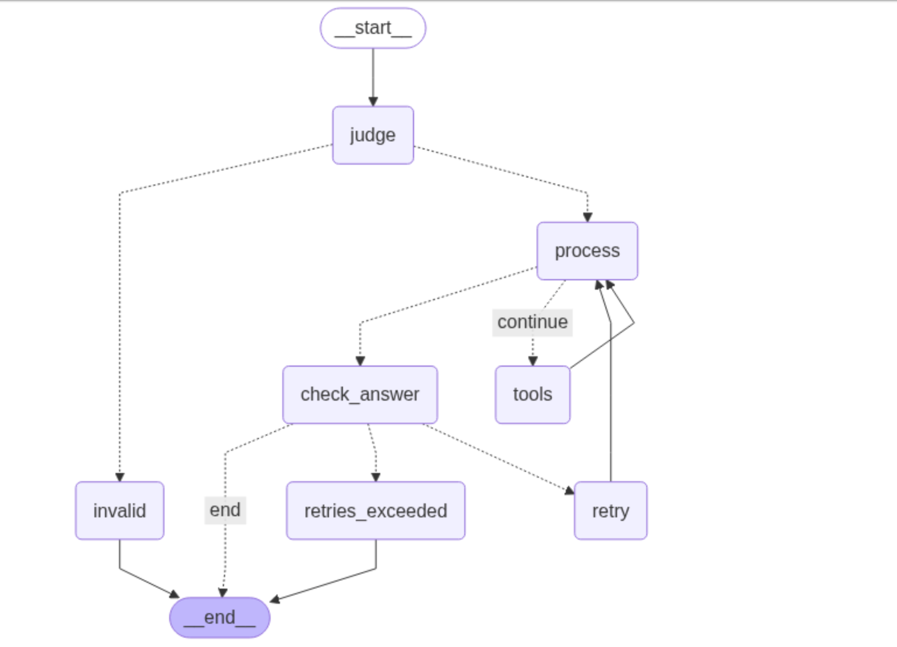

# Cashify AI Chatbot 🤖

An intelligent customer service chatbot for Cashify's smartphone marketplace. Built with LangGraph, FastAPI, and Streamlit.


## ✨ Features

- 🌍 **Multilingual Support** - English & Hindi queries
- 🛠️ **Smart Tool Integration** - Order tracking, product search, profile management  
- 🔒 **Content Safety** - Filters harmful/off-topic queries
- 📊 **Real-time Dashboard** - Live conversation monitoring
- 🔄 **Intelligent Routing** - LLM-based query validation

## 🏗️ Architecture




**Tech Stack**: Python • FastAPI • Streamlit • LangGraph • Groq API • Docker

## 🚀 Quick Start

### Prerequisites
- Docker & Docker Compose
- Groq API key

### Setup
```bash
# Clone repository
git clone git@github.com:sharmamukesh04/agent-chatbot.git
cd agent-chatbot

# Environment setup
echo "GROQ_API_KEY=your_api_key_here" > .env

# Run application
docker-compose up --build
```

### Access
- **Chat Interface**: http://localhost:8502
- **API Docs**: http://localhost:8080/docs

## 🛠️ Available Tools

| Tool | Purpose |
|------|---------|
| `get_order_tracking` | Order status & delivery tracking |
| `get_personal_profile` | User profile & coins balance |
| `get_trending_product` | Product availability & pricing |
| `get_real_time_search` | Live web search for gadgets |
| `about_cashify` | Company information |


### API Usage
```bash
curl -X POST "http://localhost:8080/chat" \
  -H "Content-Type: application/json" \
  -d '{"message": "What is my order status?"}'
```

## 🛡️ Safety Features

- **LLM-based filtering** for semantic understanding
- **Multi-language detection** of harmful content
- **Standardized responses** for restricted queries
- **Post-processing checks** to prevent bypasses

## 📊 Monitoring

The Streamlit dashboard provides:
- Real-time conversation logs
- Tool execution tracking  
- Debug information panel
- Performance metrics

## 🤝 Contributing

1. Fork the repository
2. Create feature branch: `git checkout -b feature/name`
3. Commit changes: `git commit -am 'Add feature'`
4. Push branch: `git push origin feature/name`
5. Submit pull request

## 📄 License

MIT License - see [LICENSE](LICENSE) file for details.

## 🙋‍♂️ Support

- 📖 [Documentation](docs/)
- 🐛 [Issue Tracker](https://github.com/sharmamukesh04/agent-chatbot/issues)
- 💬 [Discussions](https://github.com/sharmamukesh04/agent-chatbot/discussions)

---

**⭐ Star this repo if you find it helpful!**